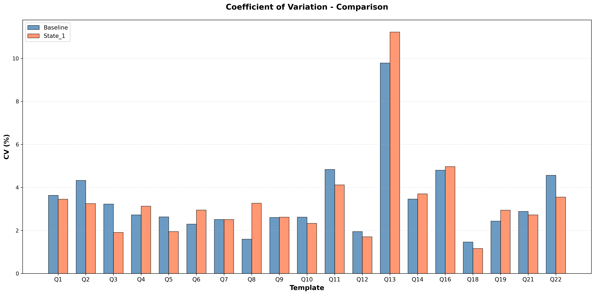

# Anhang B: Cold Cache Validierung

Dieser Anhang dokumentiert das Cold Cache Protokoll und dessen Validierung für reproduzierbare Runtime-Messungen.

## B.1 Motivation

Ohne Cold Cache würden gecachte Daten die Messungen verfälschen. PostgreSQL nutzt Shared Buffers als RAM Cache für häufig gescannte Tables und Indexes. Zusätzlich cached das Betriebssystem Disk Reads im OS Page Cache.

Erste Ausführung einer Query wäre langsam (Daten von Disk), folgende Ausführungen schnell (Daten aus Cache). Für reproduzierbare, vergleichbare Messungen muss jede Query unter identischen Bedingungen starten.

## B.2 Cold Cache Protokoll

*Bezug:* `Misc/Cache_Validation/cold_cache_validation/restart_docker/execute_queries.py`

Für jede Query-Ausführung wird folgendes Protokoll durchlaufen:

1. OrbStack (Docker VM) vollständig beenden
2. System Memory Cache leeren: `sudo purge`
3. OrbStack neu starten
4. Docker Container starten
5. Warten bis PostgreSQL Verbindungen akzeptiert
6. Query ausführen und Zeit messen mit `time.perf_counter()`

Es werden keine Warm-up Queries ausgeführt. Jede Query wird isoliert ausgeführt. Die Messung erfolgt als Wall-Clock Zeit.

## B.3 Validierung

### B.3.1 Vergleich zweier Cold Cache Läufe

*Bezug:* `Misc/Cache_Validation/Plan_Level_CC/A_01_Runtime_Variance.py`

*Daten:* `Misc/Cache_Validation/Plan_Level_CC/csv/A_01_comparison.csv`

Um die Konsistenz des Cold Cache Protokolls zu validieren, wurden zwei unabhängige Messungen der Runtime, Extraktion der Targets über gesamte Datasets durchgeführt (Baseline und State_1, jeweils 150 Seeds pro Template).

*Metrik:* Coefficient of Variation (CV) = Standardabweichung / Mittelwert × 100

Die meisten Templates zeigen einen CV von 1.5-5%, was auf konsistente Messungen hindeutet. Q13 bildet mit ~10% CV einen Ausreißer, der in B.4 untersucht wird. Die Abweichungen zwischen den beiden Läufen sind minimal.

### B.3.2 Vergleich Cold vs Warm Cache

*Bezug:* `Misc/Cache_Validation/Comparison_Cold_Warm/compare_cold_warm.py`

*Daten:* `Misc/Cache_Validation/Comparison_Cold_Warm/cold_vs_warm_20251006_184219.csv`

Um den Impact des Cachings zu quantifizieren, wurden Cold Cache und Warm Cache Messungen verglichen. Der Speedup-Faktor liegt zwischen 1.89x und 21.24x. Das Minimum zeigt Q1 mit 1.89x (1120ms → 591ms), das Maximum Q4 mit 21.24x (1066ms → 50ms). Diese Ergebnisse bestätigen, dass Caching einen signifikanten und variablen Impact auf Query-Laufzeiten hat, was die Notwendigkeit des Cold Cache Protokolls unterstreicht.

## B.4 Q13 Varianz-Anomalie

### B.4.1 Beobachtung

Q13 zeigt in beiden Validierungsläufen eine deutlich höhere Runtime-Varianz als andere Templates:

- *Q13 CV:* ~10% (Baseline: 9.79%, State_1: 11.22%)
- *Andere Templates CV:* ~2-5%

Diese Anomalie ist konsistent über beide unabhängigen Läufe.

### B.4.2 Hypothese 1: Row-Count-Varianz

*Bezug:* `Misc/Cache_Validation/Q13_Analyse/A_01_Q13_Variance.py`

*Daten:* `Misc/Cache_Validation/Q13_Analyse/A_01_q13_variance.csv`

Q13 enthält eine LIKE-Bedingung (`o_comment not like '%special%packages%'`), deren Substitution Parameter pro Seed variieren. Dies könnte zu unterschiedlichen Ergebnismengen führen. Die Analyse zeigt jedoch einen row_count CV von nur 0.33%. Die Ergebnismenge ist nahezu konstant (6.78M - 6.86M Rows). Die Hypothese ist damit widerlegt.

### B.4.3 Hypothese 2: Seq-Scan-Dauer

*Bezug:* `Misc/Cache_Validation/Q13_Analyse/A_01_Q13_Variance.py`

*Daten:* `Misc/Cache_Validation/Q13_Analyse/A_01_q13_variance.csv`

Der initiale Seq Scan könnte basierend auf dem LIKE Matching Kriterium unterschiedlich lange dauern. Die Analyse der Operator-Level Daten zeigt einen Seq Scan Mean von 485ms mit einem CV von 3.3%. Dies erklärt nicht die 10% Varianz im Template. Der Seq Scan selbst ist relativ stabil.

### B.4.4 Fazit

Die Ursache für die erhöhte Varianz von Q13 konnte nicht abschließend geklärt werden. Für das eigentliche Ziel dieser Arbeit, die evaluation verschiedener Modelle zur Runtime prediction, hat der Fall von Q13 jedoch auch keine Auswirkungen.
